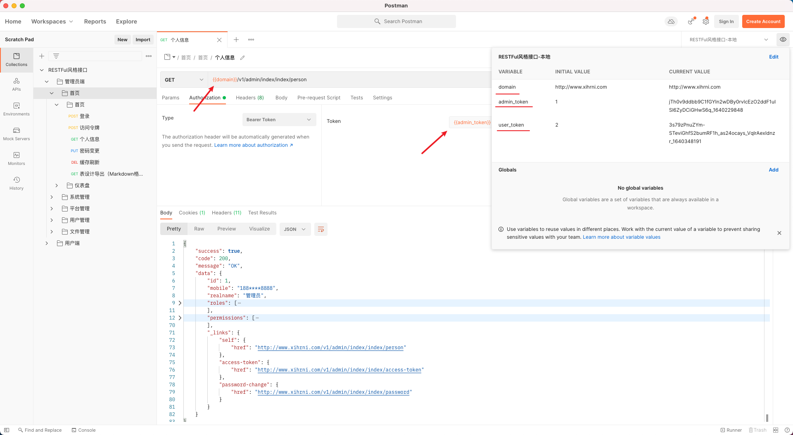

# Yii2 RESTFul 风格接口


## 依赖
- PHP 7+
- MySQL 5.7+
- Redis 6.2+
- [Yii2](https://www.yiiframework.com/doc/guide/2.0/zh-cn)


### 相关技术
- [RESTFul API](https://restfulapi.cn/)
- [Bearer Token](https://oauth.net/2/bearer-tokens/)
- [RBAC](https://www.baidu.com/s?wd=RBAC)
- [鉴权](https://baike.baidu.com/item/%E9%89%B4%E6%9D%83)

### 测试环境
- CentOS 7.8
- Nginx 1.12
- PHP 7.3
- MariaDB 10.3.25
- Redis 6.2.1
- macOS + Docker + 宝塔面板

### 运行配置

- **Nginx 网站目录**  
  网站目录为当前项目根目录
- **Nginx 运行目录**  
  运行目录为 `web` 目录
  
- **Nginx 默认文档**  
  `index.php`
  
- **Nginx 伪静态（重写规则）**
  ```ini
  location / {
    try_files $uri $uri/ /index.php$is_args$query_string;
  }
  ```
  
- **目录权限**  
  `runtime` 和 `web/assets` 目录需有可写权限，其他目录可读权限即可
  > 如果需要使用上传文件接口到本地目录，需给 `web/uploads` 可写权限
  
  
  

### 数据库

- 初始基本库  
  导入 `example` 目录下的 `base.sql` 文件到数据库表中
- 数据库链接配置  
  复制 `example` 目录下的 `db.php` 文件到项目的 `config` 文件夹中并修改相应参数

### 缓存
默认使用 Redis 缓存，可修改 `config/components.php` 和 `config/console.php` 的 `cache` 参数使用本地缓存或其它

### 接口调试
将 `example/RESTFul风格接口.postman_collection.json` 文件导入到 `Postman` 中可测试接口

> 需添加环境变量或自行替换相应变量
> 
